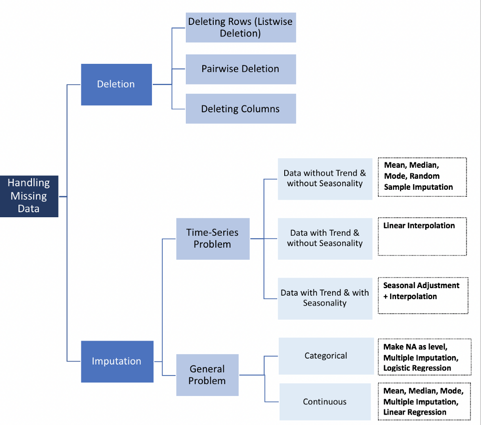

<br>

# **Synopsis** 


Airbnb is one of the world’s most innovative online marketplaces for offering and arranging lodging, primarily homestays, or tourism experiences. Founded in 2008 by Brian Chesky, Joe Gebbia, and Nathan Blecharczyk, Airbnb has facilitated millions of hospitality entrepreneurs monetize their spaces and their passions while keeping the financial benefits of tourism in their communities. Airbnb market is well blooming in London which had more than 80,000 listings as of June 2020.

The objective of this project is to understand the factors that **influence the prices listed** on Airbnb in London. It derives from curiosity about specific factors that cause the rental prices for leasing short-term lodging seems easily changed over time.


# **Packages Required**

Initially, we begin by loading the packages that will be required throughout the course of the analysis.

```{r results='hide', message=FALSE}

library(tidyverse)
# library(tidyr)
# library(dplyr)
# library(ggplot2)
library(lubridate)
library(caret)
library(data.table)
library(DT)
library(kableExtra)
library(knitr)
```


The descriptions of the packages are in the table below.

```{r echo=FALSE}
#Reading the library description csv File
pkg.desc <- read.csv("assets/desc.csv")

kable(pkg.desc) %>%
  kable_styling(bootstrap_options = c("striped", "hover", "condensed", "responsive"), full_width = F, fixed_thead = T, )
```


# **Data Preparation** {.tabset .tabset-fade .tabset-pills}


Now, let's load the dataset into the R-Environment.

## Importing Data

<b><h2>Data Source</h2></b>

This project uses the data from [Get the Data tab](http://insideairbnb.com/behind.html) in [insideairbnb](http://insideairbnb.com/index.html) website. The insideairbnb is a database website built by Murray Cox and designed by John Morris that collected all their dataset from the Airbnb website.

This project uses the dataset that contains Airbnb listings in London, United Kingdom. The time series dataset records the information of more than 80,000 listings as of 11 June 2020 (downloaded in August 2020).


<b><h2>Read the Data</h2></b>

The dataset is in `.csv` format, so we will use`read.csv` method to read the dataset.

```{r message=FALSE, error=FALSE, warning=FALSE}
raw.data <- read_csv("det_listings.csv")
```


<b><h2>Glimpse of the Data</h2></b>

After importing the dataset, Let's take a peek of our dataset! 

The dataset has **83,711 rows** and **106 columns**.


```{r}
# DATA INPUT: RAW DATASET
glimpse(raw.data)
```


## Data Cleaning {.tabset .tabset-fade .tabset-pills}

The dataset we just imported is a raw dataset. 

For the Explanatory Data purpose, we need to remove or modify data that is incorrect, incomplete, irrelevant, duplicated, or improperly formatted.


### Quality Check {.tabset .tabset-fade .tabset-pills}


#### Missing Values

Let's see how many missing values in each column.

```{r}
# Counting missing values in each column
numMissVal <-sapply(raw.data, function(x) sum(length(which(is.na(x)))))

# Result table
kable(as.data.frame(numMissVal)) %>%
  kable_styling(bootstrap_options = c("striped", "hover", "condensed", "responsive")) %>% 
  scroll_box(width = "100%", height = "250px")
```

<br>
**Observation findings :**

1. The majority of URL, host, reviews, and legal-related information are blank.
2. There aren't many listings that rent by weekly and monthly.


#### Dollar tag

There are still dollar (\$) tags in the `price`, `weekly_price`, `monthly_price`, `security_deposit`, `extra_people`, and `cleaning_fee`. These problems will affect numeric manipulation in our analysis, so we need to remove the dollar (\$) tags.


```{r}
# The updated columns stored in `clean.data` data frame
clean.data <- copy(raw.data)

# remove the "$" tag
clean.data$price <- as.numeric(gsub('[$,]','', raw.data$price))
clean.data$weekly_price <- as.numeric(gsub('[$,]','', raw.data$weekly_price))
clean.data$monthly_price <- as.numeric(gsub('[$,]','', raw.data$monthly_price))
clean.data$security_deposit <- as.numeric(gsub('[$,]','', raw.data$security_deposit))
clean.data$extra_people <- as.numeric(gsub('[$,]','', raw.data$extra_people))
clean.data$cleaning_fee <- as.numeric(gsub('[$,]','', raw.data$cleaning_fee))

# result table
head(clean.data[c("price","weekly_price","monthly_price","security_deposit","cleaning_fee")])
```


#### Duplicated Rows

There aren't any duplicated rows found.

```{r results="hide"}
# Check duplicated rows
clean.data[which(duplicated(clean.data) ==T), ] 
```

### Filtering {.tabset .tabset-fade .tabset-pills}


Some columns add little or no value to our analysis, so we need to remove these columns.


#### Zero Variance Columns


Variance measures how far a set of data is spreading out. A zero variance indicates that all of the data values are identical (no variation). It also means no deviation from the data. Thus, we cannot do our analysis with zero variance columns. These columns are removed using `nearzeroVar` method from Caret package.

**Columns Removed:**


```{r}
# Calculating the variance of each columns
zvCols <- nearZeroVar(clean.data, saveMetrics = TRUE)

# Extract column names that has a zero variance
ZVnames=rownames(subset(zvCols, nzv== TRUE))
# Remove columns that has a zero variance
clean.data <- clean.data[ , !(names(clean.data) %in% ZVnames)]

# result
ZVnames
```

```{r echo=FALSE, results="hide"}

# SAVE CHECK POINT 1
zeroVar.data <- copy(clean.data)
# save.image("workspace_after_zeroVar.RData")
```


```{r echo=FALSE, results="hide"}

# LOAD CHECK POINT 1

# load("workspace_after_zeroVar.RData")
```


#### Based on Unique Values - Character Columns


Variance measures how far a set of data is spreading out. Character columns with near 100% variance indicate that all of the data values are different in each row. These columns don't provide any group-level information to a larger population.


**Columns Removed:**


```{r message=FALSE, error=FALSE, warning=FALSE}
# Selecting distinct character columns
dist.df <-
  zeroVar.data %>% 
  select_if(is.character) %>% 
  summarise_all(list(~n_distinct(.)))

# Distinct cOlumns that has a near 100% variance
dist.df <-
  dist.df %>% 
  gather(key = var_name, value = value, 1:ncol(dist.df))

# Proportions of distinct cOlumns that has a near 100% variance
dist.df$percentUnique <- round(dist.df$value/nrow(zeroVar.data),2)

# Distinct columns that has variance proportions > 20%
unique.vars <- dist.df %>% 
  filter(percentUnique > 0.2) %>% 
  pull(var_name)

# Remove columns that has variance proportions > 20% 
zeroVar.data <- zeroVar.data[,!(names(zeroVar.data) %in% unique.vars)]

# result
unique.vars
```


#### Based on NA Values


Columns with over than 50% NA values are removed.


**Columns Removed:**


```{r}
# Count NA rows in each columns
na_df <- zeroVar.data %>% 
  summarise_all(list(~sum(is.na(.))))

# Summary of NA rows in each column
na_df <- na_df %>% 
  gather(key = var_name, value = value, 1:ncol(na_df))

# Proportions of NA rows in each column
na_df$numNa <- round(na_df$value/nrow(zeroVar.data),2)

# Column that has 50% NA rows
na_var <- na_df %>% 
  filter(numNa > 0.5) %>% pull(var_name)

# Remove columns that has proportions > 50% variance
zeroVar.data <- zeroVar.data[,!(names(zeroVar.data) %in% na_var)]

# result
na_var
```


#### Pattern Matching

Column names contain strings "night", and “location” are removed, except `minimum_nights`and `review_scores_location`, because those columns are irrelevant information to our analysis.

**Columns Removed:**


```{r}
# Make the pattern
pattern <- colnames(
  zeroVar.data %>%
  select(contains("night"),
         contains("location")
         )
)
  


# Excluding "minimun_nights" and "review_scores_location" in the pattern
pattern <- pattern[!(pattern == "minimum_nights" | pattern == "review_scores_location")]

# Remove columns that has similar names with columns in the pattern
zeroVar.data <- zeroVar.data[,!(names(zeroVar.data) %in% pattern)]

# result
pattern

```


#### Manual Removal


There aren't any better pattern left, so some of the columns are removed manually.


**Columns Removed:**

```{r}
# List of columns that will be removed manually
dropCol <-
  c(
  "host_neighbourhood",
  "host_listings_count",
  "host_verifications",
  "host_identity_verified",
  "street",
  "neighbourhood",
  "city",
  "property_type",
  "calendar_updated",
  "calendar_last_scraped",
  "number_of_reviews_ltm",
  "first_review",
  "calculated_host_listings_count",
  "calculated_host_listings_count_entire_homes",
  "calculated_host_listings_count_private_rooms",
  "guests_included",
  "extra_people"
  )

zeroVar.data <- zeroVar.data[,!(names(zeroVar.data) %in% dropCol)]


# result
dropCol
```


```{r echo=FALSE, results="hide"}

# SAVE CHECK POINT 2
# save.image("workspace_after_filtering.RData")
```


```{r echo=FALSE, results="hide"}

# LOAD CHECK POINT 2

# load("workspace_after_filtering.RData")
```

### Data Formatting

Some columns need to be changed as factors.


```{r}
# data format : factor
zeroVar.data$host_name <- as.factor(zeroVar.data$host_name)
zeroVar.data$host_response_time <-  as.factor(zeroVar.data$host_response_time)
zeroVar.data$host_response_rate <- as.factor(zeroVar.data$host_response_rate)
zeroVar.data$host_acceptance_rate <- as.factor(zeroVar.data$host_acceptance_rate)
zeroVar.data$host_total_listings_count <- as.factor(zeroVar.data$host_total_listings_count)

zeroVar.data$neighbourhood_cleansed <- as.factor(zeroVar.data$neighbourhood_cleansed)
zeroVar.data$room_type <- as.factor(zeroVar.data$room_type)
zeroVar.data$cancellation_policy <- as.factor(zeroVar.data$cancellation_policy)


zeroVar.data$review_scores_rating <-  as.factor(zeroVar.data$review_scores_rating)
zeroVar.data$review_scores_accuracy <-  as.factor(zeroVar.data$review_scores_accuracy)
zeroVar.data$review_scores_cleanliness <-  as.factor(zeroVar.data$review_scores_cleanliness)
zeroVar.data$review_scores_checkin <-  as.factor(zeroVar.data$review_scores_checkin)
zeroVar.data$review_scores_communication <-  as.factor(zeroVar.data$review_scores_communication)
zeroVar.data$review_scores_location <-  as.factor(zeroVar.data$review_scores_location)
zeroVar.data$review_scores_value <-  as.factor(zeroVar.data$review_scores_value)

```


`last_scraped`, `host_since`, and `last_review` changed into `ymd` format using `lubridate` library.


```{r}
zeroVar.data$last_scraped <- ymd(zeroVar.data$last_scraped)
zeroVar.data$host_since <- ymd(zeroVar.data$host_since)
zeroVar.data$last_review <- ymd(zeroVar.data$last_review)
```


### NA Values Treatment {.tabset .tabset-fade .tabset-pills}

#### Problem Statement

After filtering the dataset, some columns still have missing values.

```{r}
# Counting missing values in each column
clean_NAval <-sapply(zeroVar.data, function(x) sum(length(which(is.na(x)))))

# Result table
kable(as.data.frame(clean_NAval)) %>%
  kable_styling(bootstrap_options = c("striped", "hover", "condensed", "responsive")) %>% 
  scroll_box(width = "100%", height = "250px")
```

<br>
The missing value can severely distort the distribution of the data. However, there isn't any better way to deal with missing data. Removing columns or rows with missing values can produce a bias in the analysis. Note that imputation does not necessarily give better results. 

<br>
[Alvira Swalin](https://towardsdatascience.com/@aswalin) gave a better explanation about how to handle missing data in [towardsdatascience.com](https://towardsdatascience.com/how-to-handle-missing-data-8646b18db0d4). The methods to handle missing values are as follow:


<center>
{width=120%}
</center>


#### Problem Solvings

Based on the previous flowchart, our dataset has both general problems, continuous and categorical. We use data imputation only on factor and numeric data format. 

<br>
<h4>Continuous</h4>
The numerical columns that have missing values are `bathrooms`, `bedrooms`, `beds`, `security_deposit`, and `cleaning_fee`. we can replace the missing values in these numerical columns with the average of the corresponding column.


First, get the averages of each numeric column.

```{r}
# Find average value 
baths_mean <- mean(zeroVar.data$bathrooms,  na.rm = TRUE)
bedrms_mean <- mean(zeroVar.data$bedrooms,  na.rm = TRUE) 
beds_mean <- mean(zeroVar.data$beds,  na.rm = TRUE) 
seqdep_mean <- mean(zeroVar.data$security_deposit,  na.rm = TRUE) 
cleanfee_mean <- mean(zeroVar.data$cleaning_fee,  na.rm = TRUE)
monthlyreviews_mean <- mean(zeroVar.data$reviews_per_month, na.rm = TRUE)
```


Then replace the missing values with the averages of the corresponding columns.

```{r}
zeroVar.data$bathrooms[is.na(zeroVar.data$bathrooms)] <- baths_mean
zeroVar.data$bedrooms[is.na(zeroVar.data$bedrooms)] <- bedrms_mean
zeroVar.data$beds[is.na(zeroVar.data$beds)] <- beds_mean
zeroVar.data$security_deposit[is.na(zeroVar.data$security_deposit)] <- seqdep_mean
zeroVar.data$cleaning_fee[is.na(zeroVar.data$cleaning_fee)] <- cleanfee_mean
zeroVar.data$reviews_per_month[is.na(zeroVar.data$reviews_per_month)] <- monthlyreviews_mean
```


<br>
<h4>Categorical</h4>
The categorical columns that have missing values are `host_name`, `host_response_time`, `host_response_rate`, `host_acceptance_rate`, `host_total_listings_count`, `neighbourhood_cleansed`, `review_scores_rating`, `review_scores_accuracy`, `review_scores_cleanliness`, `review_scores_checkin`, `review_scores_communication`, `review_scores_location`, `review_scores_value`, and `cancellation_policy`


We can treat the missing values in these categorical as levels. As example, let's see the levels attribute of `host_response_time`. The missing values are treated as one of the levels in the `host_response_time`.

```{r}
levels(zeroVar.data$host_response_time)
```


## Cleaned Dataset

Here's the cleaned data set:


```{r}
datatable(head(zeroVar.data, 50), 
          style = 'bootstrap', 
          class = 'table-bordered table-condensed')
```


## Summary of Variables


The summary of the variables of dataset are in the table below.

```{r echo=FALSE}
#Reading the library description csv File
var.desc <- read.csv("assets/var_desc.csv")

kable(var.desc) %>%
  kable_styling(bootstrap_options = c("striped", "hover", "condensed", "responsive"), full_width = F, fixed_thead = T, )
```


```{r echo=FALSE, results="hide"}

# SAVE CHECK POINT 3
# save.image("ready_EDA.RData")
```


```{r eval=FALSE, echo=FALSE, results="hide"}

# LOAD CHECK POINT 3

load("ready_EDA.RData")
```


# **Exploratory Data Analysis & Data Visualization** {.tabset .tabset-fade .tabset-pills}

## Case 1
<h2>The Top 5 Cities with The Most Listing in London</h2>


```{r message=FALSE, error=FALSE, warning=FALSE}
# Count the numbers of listings of each room type
property_df <-  zeroVar.data %>% 
  group_by(neighbourhood_cleansed, room_type) %>% 
  summarize(Freq = n()) %>% #  number of observations within a group
  ungroup()

# Count the total listing of each neighborhood
total_property <-  zeroVar.data %>% 
  filter(room_type %in% c("Private room", "Entire home/apt", "Shared room", "Hotel room")) %>% 
  group_by(neighbourhood_cleansed) %>% 
  summarize(sum = n())
  
# Merge the data and select the top 5 cities
merge_prop <- merge (property_df, total_property, by= "neighbourhood_cleansed") %>% 
  arrange(-sum, -Freq) %>% 
  head(20)


# Sort the neighborhood from the most listing
merge_prop$size_f <- factor(merge_prop$neighbourhood_cleansed, levels=c('Westminster','Tower Hamlets','Hackney','Camden','Kensington and Chelsea'))


# Assign each neighborhood and room type with specific color
color_table <- tibble(
  neighbourhood_cleansed = c('Westminster','Tower Hamlets','Hackney','Camden','Kensington and Chelsea'),
  color = c("salmon", "goldenrod1", "springgreen3", "lightslateblue", "violetred")
  )

ct_room <- tibble(
  room_type = c('Entire home/apt','Private room','Hotel room','Shared room'),
  color = c("yellow", "blue4", "lightblue", "darkgreen")
  )


# a factor variable in the same order as the color table
merge_prop$neighbourhood_cleansed <- factor(merge_prop$neighbourhood_cleansed, levels = color_table$neighbourhood_cleansed)
merge_prop$room_type <- factor(merge_prop$room_type, levels = ct_room$room_type)


```


The top 5 Cities with the most listing go to:


```{r}
# Plot the data by the neighborhood

merge_prop %>% 
  ggplot() +
  geom_bar(aes(reorder(as.factor(neighbourhood_cleansed), Freq), Freq, fill=neighbourhood_cleansed), stat = 'identity') +
  geom_text(aes(neighbourhood_cleansed, sum, label = sum), hjust = 2.0,  color = "white") +
  labs(x="Room Type", y="Count") +
  scale_fill_manual(values = color_table$color) +
  theme(legend.position = 'none') +
  ggtitle("The Most Listing in London by Neighborhood") + 
  xlab("Neighbourhood") + 
  ylab("Number of Listings") +
  theme(legend.position = 'none',
        plot.title = element_text(color = 'black', size = 14, face = 'bold', hjust = 0.5),
        axis.title.y = element_text(),
        axis.title.x = element_text()) +
  coord_flip()
```


<br>
Now, let's break down each neighborhood to their room type!


```{r}
# Plot the data by the room type
merge_prop %>% 
  ggplot() +
  geom_bar(aes(reorder(as.factor(room_type), Freq), Freq, fill=room_type), stat = 'identity') +
  scale_fill_manual(values = ct_room$color) +
  theme(legend.position = "none")+
  labs(title = 'Number of Room Type by Neighbourhood',
       x='Room Type', 
       y='Number of Listings') +
  facet_wrap(~size_f, ncol = 2) +
  theme(legend.position = 'none',
        plot.title = element_text(color = 'black', size = 14, face = 'bold', hjust = 0.5)) +
  coord_flip()
```


<br>
**Observation findings :**

1. The room type of entire home/apartment and private room contribute the most on Airbnb listings in London.
2. The room type of hotel room and shared room contribute the least on Airbnb listings in London.


## Case 2
<h2>Mean Price Comparison of Top 5 Cities with The Most Listing in London</h2>

<br>
Let's find out about the correlation between mean price and number of listings!


```{r message=FALSE, error=FALSE, warning=FALSE}

# Count the mean price for every neighborhood
mean_price_neighbor <-  zeroVar.data %>% 
  group_by(neighbourhood_cleansed) %>% 
  summarize(mean_neighbor = mean(price, na.rm = TRUE)) %>% #  the number of observations within a group
  ungroup()

# Count the total listing of each neighborhood
listing_sum <-  zeroVar.data %>% 
  group_by(neighbourhood_cleansed) %>% 
  summarize(sum = n())
  
# Merge the data and select the top 5 cities with the most listing
merge_mean <- merge (mean_price_neighbor, listing_sum, by= "neighbourhood_cleansed") %>% 
  arrange(-sum, -mean_neighbor) %>% 
  head(5)

# Assign each neighborhood and room type with specific color
color_table <- tibble(
  neighbourhood_cleansed = c('Westminster','Tower Hamlets','Hackney','Camden','Kensington and Chelsea'),
  color = c("salmon", "goldenrod1", "springgreen3", "lightslateblue", "violetred")
  )

ct_room <- tibble(
  room_type = c('Entire home/apt','Private room','Hotel room','Shared room'),
  color = c("yellow", "blue4", "lightblue", "darkgreen")
  )


# a factor variable in the same order as the color table
merge_mean$neighbourhood_cleansed <- factor(merge_mean$neighbourhood_cleansed, levels = color_table$neighbourhood_cleansed)

```

City with the highest mean price goes to:


```{r message=FALSE, error=FALSE, warning=FALSE}
# Plot the data
merge_mean %>% 
  ggplot(aes(x = reorder(neighbourhood_cleansed, mean_neighbor), y = mean_neighbor, fill = neighbourhood_cleansed)) +
  geom_col(stat ="identity") +
  scale_fill_manual(values = color_table$color) +
  coord_flip() +
  theme_gray() +
  labs(x = "Neighbourhood Group", y = "Price") +
  geom_text(aes(label = round(mean_neighbor,digit = 2)), hjust = 2.0, color = "white", size = 3.5) +
  ggtitle("Mean Price comparison for each Neighbourhood", subtitle = "Price vs Neighbourhood") + 
  xlab("Neighbourhood") + 
  ylab("Mean Price ($)") +
  theme(legend.position = "none",
        plot.title = element_text(color = "black", size = 14, face = "bold", hjust = 0.5),
        plot.subtitle = element_text(color = "darkblue", hjust = 0.5),
        axis.title.y = element_text(),
        axis.title.x = element_text(),
        axis.ticks = element_blank())
```


Well, what about the interaction between the mean price of those cities and their room type ?


```{r message=FALSE, error=FALSE, warning=FALSE}

# Count mean price for each room type in every neighborhood
property_mean <-  zeroVar.data %>% 
  group_by(neighbourhood_cleansed, room_type) %>% 
  summarize(mean_room = mean(price, na.rm = TRUE)) %>% #  number of observations within a group
  ungroup()


# Count listings of each room type in every neighborhood
property_sum <-  zeroVar.data %>% 
  filter(room_type %in% c("Private room", "Entire home/apt", "Shared room", "Hotel room")) %>% 
  group_by(neighbourhood_cleansed) %>% 
  summarize(sum = n())  


# merge data
merge_mean_neighbor <- merge (property_mean, property_sum, by= "neighbourhood_cleansed") %>% 
  arrange(-sum, -mean_room) %>% 
  head(20)


# Sort the neighborhood from the most listing
merge_mean_neighbor$sorts <- factor(merge_mean_neighbor$room_type, levels=c('Hotel room','Entire home/apt','Shared room','Private room'))


# a factor variable in the same order as the color table
merge_mean_neighbor$neighbourhood_cleansed <- factor(merge_mean_neighbor$neighbourhood_cleansed, 
                                                     levels = color_table$neighbourhood_cleansed)

merge_mean_neighbor$room_type <- factor(merge_mean_neighbor$room_type, 
                                        levels = ct_room$room_type)


# Plot the data by the room type
merge_mean_neighbor %>% 
  ggplot()+
  geom_col(aes(x = reorder(neighbourhood_cleansed, mean_room), 
               y = mean_room,
               fill = neighbourhood_cleansed), 
           position = "dodge") +
  scale_fill_manual(values = color_table$color) +
  theme(legend.position = 'none') +
  ggtitle("Average Price by Room Type") +
  xlab("Neighbourhood") + 
  ylab("Mean Price") +
  theme(legend.position = "none",
        plot.title = element_text(color = "black", size = 14, face = "bold", hjust = 0.5),
        plot.subtitle = element_text(color = "darkblue", hjust = 0.5),
        axis.title.y = element_text(),
        axis.title.x = element_text(),
        axis.ticks = element_blank()) +
  facet_wrap(~ sorts, ncol = 2) +
  coord_flip()

```


<br>
**Observation findings :**

1. Westminster has the highest mean price because the area has the highest hotel room mean price.
2. Mostly the hotel room price gives a meaningful impact on the calculation of the average price in each neighbourhood.
4. The private room price gives the least impact on the calculation of the average price in each neighbourhood.


## Case 3
<h2>The Interaction between Price and Review at Westminster and Hackney</h2>


<br>
Rumour has it that the host often increase the listing price based on their will. Do customers' reviews have an impact on increasing the listings price? The vertical lines represent the mean price for each neighbourhood.


```{r message=FALSE, error=FALSE, warning=FALSE}

# Find the mean price for each neighbour
df1 <- zeroVar.data %>% 
  filter(neighbourhood_cleansed == "Westminster" | neighbourhood_cleansed == "Hackney") %>% 
  group_by(neighbourhood_cleansed) %>% 
  summarise(meanprice2 = mean(price))


# Plot the interaction between Price and Number or Reviews
zeroVar.data %>% 
  filter(neighbourhood_cleansed == "Westminster" | neighbourhood_cleansed == "Hackney") %>% 
  ggplot(aes(price, number_of_reviews)) +
  geom_jitter(aes(col = number_of_reviews)) +
  scale_x_log10() +
  facet_wrap(~neighbourhood_cleansed) +
  labs(title = "Number of Reviews Vs Price", x="Price ($)", y= "Number of Reviews",
       color='Degree of Reviews') +
  theme(plot.title = element_text(hjust = 0.5)) +
  geom_vline(data=filter(df1, neighbourhood_cleansed == "Westminster"), 
             aes(xintercept = meanprice2), colour="salmon") + 
  geom_vline(data=filter(df1, neighbourhood_cleansed == "Hackney"), 
             aes(xintercept = meanprice2), colour="springgreen3")
```


<br>
**Observation findings :**

1. Both neighbourhoods show that the higher number of reviews, the listing price is close to or below the neighbourhood mean price.
2. Both neighbourhoods also show that the higher the listing price, the less it has the number of reviews.
3. Both graphs show that customers give more reviews on a listing that has a price around or below the mean price in each neighbourhood.


